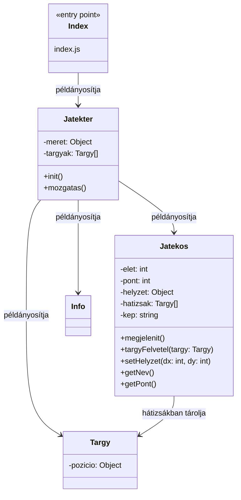

# Lepkedős játék

Feladat: játéktér, játékos  
- Nyilakkal való lépkedés  
- Ne tudjon lemenni a játéktérről  
- Véletlenszerű tárgyak → plusz pont  
- Info panel: játékos neve és pontja  

---

---

---
Beadtam, hogy a jegyzet alapján csináljon nekem egy jól kinéző readme-be berakhato uml áőrbrát. Majd arra kértem kódot és leírtam neki a pokemonos API oldal linkjét. Átnéztem a kódokat, amit kaptam és amit már csináltunk órán, de az ő kódjában nem úgy volt azt átírtam. Amit nem tanultunk még azt pedig elmagyaráztattam vele, hogy mit csinál és micsoda az.

link: https://chatgpt.com/share/69f9cf86-4120-8385-8250-5610228b0924
---

Lehetne még:
- más karaktert választani
- háttérrel valamit csináni hogy ne szürke négyzetek legyenek
- lépés számlálás

---

Stolár-Németh Villő