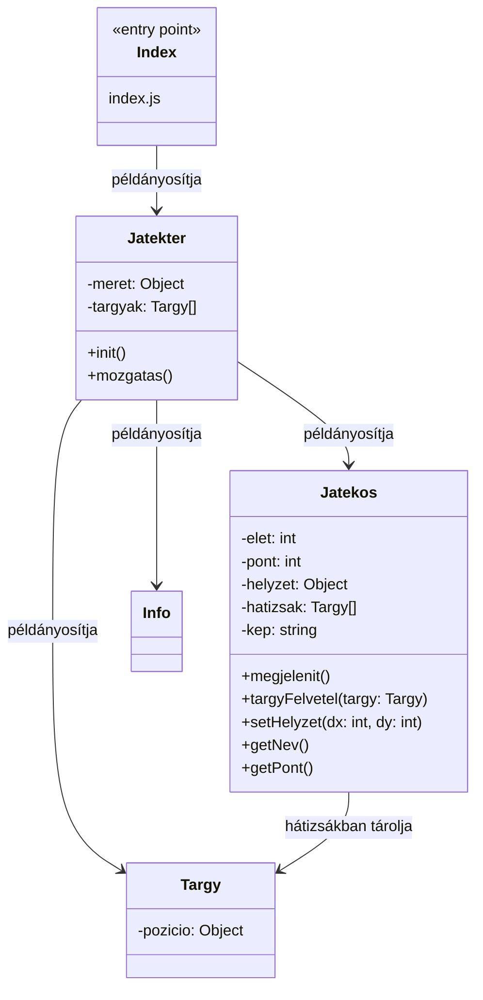

# Lepkedős játék

Feladat: játéktér, játékos  
- Nyilakkal való lépkedés  
- Ne tudjon lemenni a játéktérről  
- Véletlenszerű tárgyak → plusz pont  
- Info panel: játékos neve és pontja  

---

---

Stolár-Németh Villő